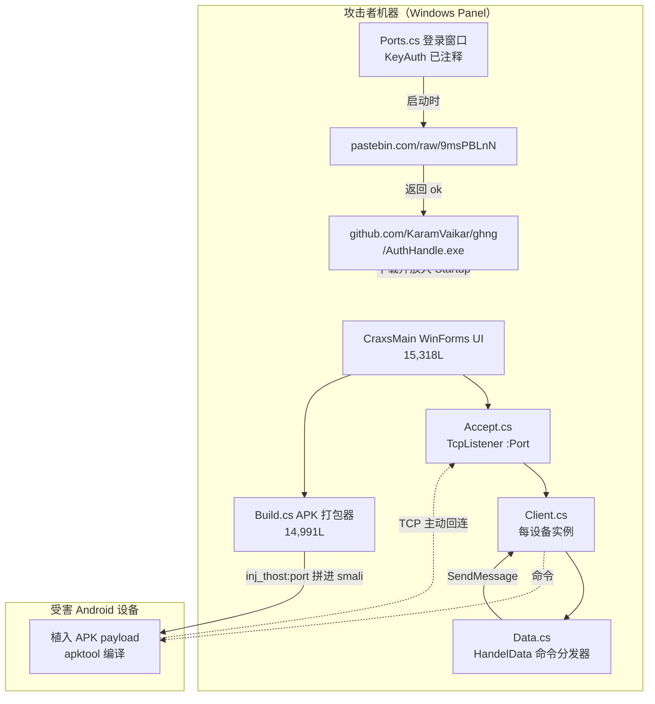
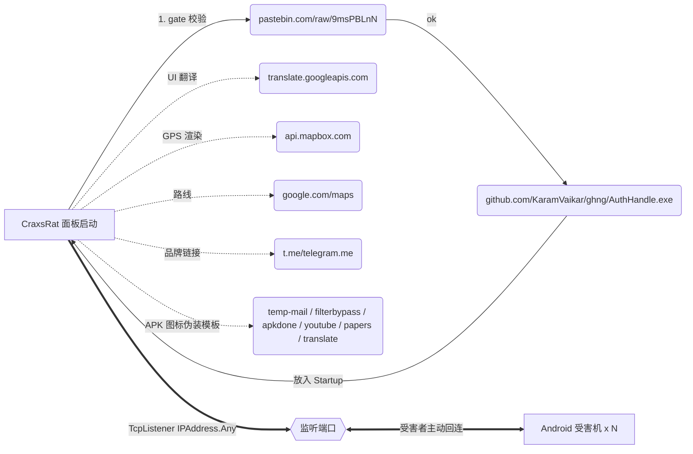
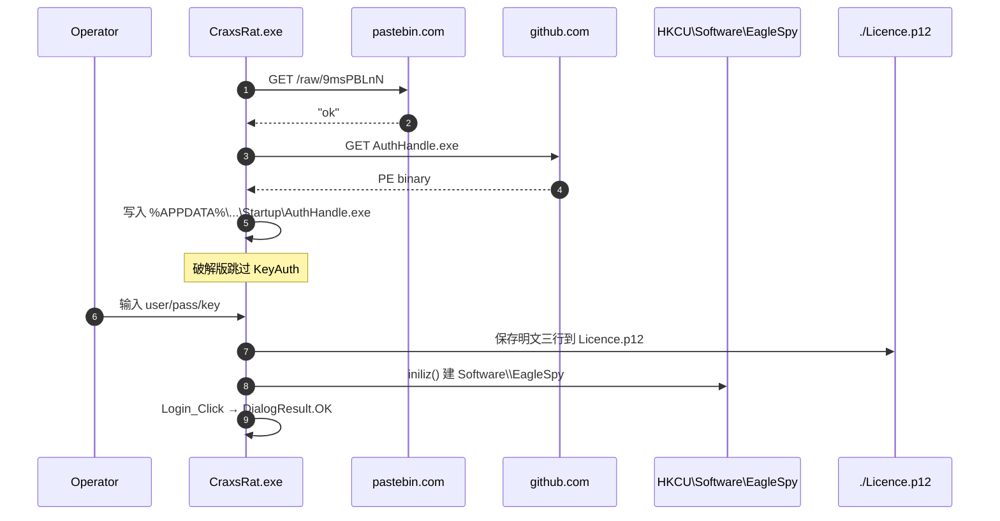
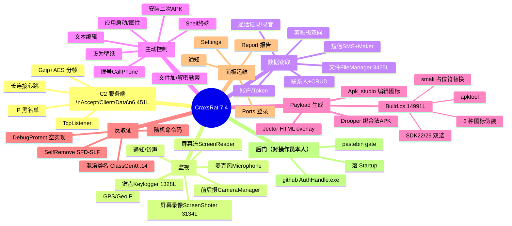

# CraxsRat Src 7.4 @Enfected — 源码分析报告

> **性质定性**：本目录是 CraxsRat（又名 EagleSpy）Android RAT 的 **C2 控制端（Command & Control panel）** 源码，采用 .NET/WinForms（VB→C#，86,263 行非-designer 代码），命名空间 `Eagle_Spy`。它监听 TCP 端口接受被感染 Android 设备的回连，同时自带 APK 构建 / 注入 / 签名 / 加固 / 分发流水线。本次分析所标注的凭证、URL、密钥、协议格式，均可直接用于蓝队 IOC / IDS 特征提取。

---

## 1. 总体架构

| 层 | 目录 / 文件 | 说明 |
|---|---|---|
| 进程入口 | [MyApplication.cs](CraxsRat.My/MyApplication.cs) (111L)、[Program.cs](CraxsRat/Program.cs) (27L) | `WindowsFormsApplicationBase`；启动即从 pastebin 拉取 gate |
| C2 服务端 | [CraxsRat.sockets/](CraxsRat.sockets/) — Accept.cs (269L) / Client.cs (601L) / Data.cs (5581L) | 每个开放端口一个 `Accept`，每个受害机一个 `Client`，`Data.HandelData` 是命令分发器 |
| 主控台 UI | [CraxsMain.cs](CraxsRat/CraxsMain.cs) (**15,318L**) | 客户端列表、右键菜单、命令按钮 |
| 载荷构建 | [Build.cs](CraxsRat/Build.cs) (**14,991L**) | apktool → smali 占位符替换 → SignApk.jar → zipalign → APKEditor 加固 |
| 认证 | [Ports.cs](CraxsRat/Ports.cs) (1,251L) + [DebugProtect1.cs](CraxsRat/DebugProtect1.cs) (17L) | **KeyAuth 登录已被彻底注释——本副本是破解版** |
| 编解码/加密 | [Codes.cs](CraxsRat/Codes.cs) (1,403L) | AES-Rijndael、GZip、Base64、包格式化、翻译代理 |
| 地理定位 | [GeoIP.cs](CraxsRat/GeoIP.cs) (386L) + [GetFlagThisIp.cs](CraxsRat/GetFlagThisIp.cs) (47L) | MaxMind GeoIP.dat 本地库，为每个连接打国旗 |
| 常量表 | [SecurityKey.cs](CraxsRat/SecurityKey.cs) (160L)、[reso.cs](CraxsRat/reso.cs) (778L)、[infoServer.cs](CraxsRat/infoServer.cs) (17L) | 会话动态生成的"命令码"、协议分隔符、`domen = "plugens.angel.plugens"` |



---

## 2. 系统操作与网络协议

### 2.1 TCP 监听端（面板→受害）

- **绑定 `IPAddress.Any`**，用户在 `Ports` 表单里填端口 → [Accept.cs:51](CraxsRat.sockets/Accept.cs) `new TcpListener(IPAddress.Any, num)`；缓冲 16 KB，超时 -1（永不）。
- 每次 `AcceptTcpClient` → 生成 `Client` 实例 [Accept.cs:124](CraxsRat.sockets/Accept.cs)；若同一远端已存在，丢弃防重复。
- **每客户端读缓冲 5 MB** [Client.cs:145-146](CraxsRat.sockets/Client.cs)，长连接心跳 45 s [Client.cs:200](CraxsRat.sockets/Client.cs)。
- `Blocklist` [Client.cs:323](CraxsRat.sockets/Client.cs) — 支持面板拉黑 IP。

### 2.2 消息帧格式

面板 → 设备包结构（[Codes.cs:1164 `FormatPacket`](CraxsRat/Codes.cs)）：

```
<gzip(命令字符串).length>\0<数据.length>\0<gzip 命令>\0<原始数据 bytes>
```

命令字段由 `SPL_SOCKET | SPL_DATA | SPL_LINE | SPL_ARRAY` 四级分隔符组合，其中 `SPL_SOCKET` 是 **AES 解密 `res\Config\Pass.inf` 得到的用户密码** [Data.cs:5237、5255](CraxsRat.sockets/Data.cs)：

| 分隔符 | 值 | 备注 |
|---|---|---|
| `SPL_SOCKET` | `password`（AES 解密自 Pass.inf，密钥 `THEKEY`） | 未知则用 `X0X0X` |
| `SPL_DATA` | `x0D0x` | [Data.cs:5256](CraxsRat.sockets/Data.cs) |
| `SPL_LINE` | `x0L0x` | 行内换行 |
| `SPL_ARRAY` | `x0A0x` | 列表边界 |

### 2.3 命令字典（部分 —— 见 [SecurityKey.cs:95-137](CraxsRat/SecurityKey.cs)、[Data.cs:1380+](CraxsRat.sockets/Data.cs)）

`SecurityKey.Key()` 用 `count + 3位随机字母 + 毫秒` 每次启动重新生成——**会话独有**，无法静态签名。但域路径固定：

| 逻辑域后缀 | 用途 |
|---|---|
| `.info` | 设备信息、账户、通话中、剪贴板、更新 |
| `.calls` / `.sms` / `.contacts` | 通话记录、短信、联系人 CRUD |
| `.files` | 文件浏览 / 下载 / 上传 / 加解密 / 打包 / 改名 / 壁纸 |
| `.apps` | 已安装应用清单、打开、卸载、属性 |
| `.microphone` | 麦克风流入/流出，8000 Hz |
| `.terminal` | ShellTerminal 命令执行 |
| `.contacts / .calls` | 增删改 |

**共 27 个高阶命令**（getinfo、getCalls、getSMS、getContacts、getCamera、Lockscreen、getfiles、Bing、getCommand、getGSM、getGPS、getUpdate、down_info、downByte、upload_info、uploadByte、MicwaveOutByte、MicwaveinByte、ImageViewer、Apps、Account、Information、editor、SHOT、Keylogger、AppsProperties、acquire、getClipboard）。

---

## 3. 向外发包的 IP / URL 地址

**没有硬编码的 C2 IP**——受害端 C2 地址是运营者在 `Build` 表单里填入的 `TextIP:po`（默认从 `MySettingsProperty.Settings.inj_thost` 恢复，[Build.cs:10484](CraxsRat/Build.cs)），然后拼接到最终打包字符串 [Build.cs:13281-13283、13421-13423](CraxsRat/Build.cs)，写入 smali 常量。**面板机器本身发起的所有外部连接**列表如下：

| # | URL / 地址 | 位置 | 用途 |
|---|---|---|---|
| 1 | `https://pastebin.com/raw/9msPBLnN` | [MyApplication.cs:30](CraxsRat.My/MyApplication.cs) | **启动 gate**——返回 `ok` 才继续 |
| 2 | `https://github.com/KaramVaikar/ghng/raw/refs/heads/main/AuthHandle.exe` | [MyApplication.cs:31](CraxsRat.My/MyApplication.cs) | **投放** `AuthHandle.exe` 到 **当前用户 Startup 文件夹** — 供应链后门/信息窃取 |
| 3 | `https://translate.googleapis.com/translate_a/single?...` | [Codes.cs:599](CraxsRat/Codes.cs) | 翻译 UI 到阿拉伯语/中文 |
| 4 | `https://api.mapbox.com/styles/v1/` | [CraxsMain.cs:4384](CraxsRat/CraxsMain.cs) | GPS 定位地图渲染 |
| 5 | `https://api.tiles.mapbox.com/mapbox-gl-js/v1.0.0/mapbox-gl.{js,css}` | [Craxs_Rat.Resources.Designer.cs:544-545](Craxs_Rat.Resources.Designer.cs) | Mapbox JS 库 |
| 6 | `https://play.google.com/store/apps/details?id=...` | [AppsProperties.cs:217](CraxsRat/AppsProperties.cs) | 打开 Play Store 查看目标 APP |
| 7 | `https://www.google.com/maps/dir/...` | [LocationManager.cs:648](CraxsRat/LocationManager.cs) | Google Maps 路线 |
| 8 | `https://telegram.me/eaglespy` | [CraxsMain.cs:3773](CraxsRat/CraxsMain.cs) | 作者 Telegram（品牌） |
| 9 | `https://t.me/n0xi0s` | [CraxsMain.cs:8736](CraxsRat/CraxsMain.cs) | 破解者 / 分发者标签 |
| 10 | `https://t.me/Mr_Coder_X` | [Ports.cs:693](CraxsRat/Ports.cs) | 登录窗口备用联系人 |
| 11 | `telegram.com` | [CraxsSettinngs.cs:446](CraxsRat/CraxsSettinngs.cs)、[CraxsySettinngs.cs:446](CraxsRat/CraxsySettinngs.cs) | `Process.Start` 跳转 |
| 12 | **APK Fake 模板 URL**（Build 表单预设） | | |
| 12a | `https://temp-mail.org` | [Build.cs:13166](CraxsRat/Build.cs) | 一次性邮箱伪装 |
| 12b | `https://www.filterbypass.me` | [Build.cs:13179](CraxsRat/Build.cs) | 代理伪装 |
| 12c | `https://apkdone.com/` | [Build.cs:13191](CraxsRat/Build.cs) | 应用商店伪装 |
| 12d | `https://www.youtube.com` | [Build.cs:13214](CraxsRat/Build.cs) | Youtube lite 伪装 |
| 12e | `https://papers.co` | [Build.cs:13227](CraxsRat/Build.cs) | 壁纸 App 伪装 |
| 12f | `https://translate.google.com` | [Build.cs:13240](CraxsRat/Build.cs) | Google Translate 伪装 |

> **注意**：只有 `0.0.0.0`、`127.0.0.1` 出现在源码中（都是 `Client.Keys` 默认占位符），**没有任何硬编码公网 IPv4/IPv6**。C2 是运营者可变的。

### 3.1 网络出口图（面板视角）



---

## 4. 认证系统

### 4.1 官方设计（**已在此副本注释掉**）
[Ports.cs:47-52、1006-1131、1192-1223](CraxsRat/Ports.cs) — 原 `KeyAuthApp = new api("CraxsRat", ownerid="IJoPRCSjQ0", secret="555e56348f074d896570918dc73b863135b5c2ecadcab6539df539dfe3701e4c", version="1.0")`，登录时 HTTP POST 到 `Codes.ReadConfig(Session/Ping/Check)`，用 `EncryptRJ256` + AES-CBC 与服务器 3 次握手：`api key` + `email` + `password` + `HWID = GetHWID()+RegistryHandler.Get_ID_ASSIST()`。

### 4.2 此源码实际路径
```
Login_Click → SaveTextBoxValues() → DialogResult.OK   // 无验证直接放行
```
即：**KeyAuth 已被剥离，仅本地保存凭证到 `Licence.p12`**（[Ports.cs:1163-1187](CraxsRat/Ports.cs)）。这是典型的 **crack 版特征**，也和 `MyApplication.cs` 里注入 pastebin/github 后门相互印证——破解者用后门换取"免费"版。

### 4.3 会话与本机秘密
| 项 | 位置 | 值/来源 |
|---|---|---|
| 面板私密码 (Pass.inf) | [Data.cs:5214-5237](CraxsRat.sockets/Data.cs) | `Codes.AES_Decrypt(read, THEKEY)`；默认 `X0X0X` |
| Config.json 密钥 | [Codes.cs:171](CraxsRat/Codes.cs) | `q}%h%anHhw;sW.u*$eX{W]EYCHo9m8PxK;` |
| 邮箱注册项密钥 | [RegistryHandler.cs:55、72](CraxsRat/RegistryHandler.cs) | `W3Ndxet0sdZYtqykGiGCeiIMDoF` |
| 会话命令码 | [SecurityKey.Key()](CraxsRat/SecurityKey.cs) | `count + 3 rand letters + ms`，每次启动重生 |
| 反调试 | [DebugProtect1.cs](CraxsRat/DebugProtect1.cs) | `CheckRemoteDebuggerPresent` / `IsDebuggerPresent`——**函数体已被清空为空实现，形同虚设** |
| 注册表持久 | `HKCU\Software\EagleSpy` | Email、Language、ID、tip 等 |

### 4.4 认证流程



---

## 5. 各功能按类别 —— 代码文件 + 行数

> 行数已排除 `*.Designer.cs`（WinForms 自动生成 UI 布局代码）。核心逻辑集中在 CraxsMain.cs + Data.cs + Build.cs 三巨头（35,890 行，占非-designer 总量的 42%）。

### A. 网络 / C2 底座
| 文件 | 行数 | 功能 |
|---|---|---|
| [CraxsRat.sockets/Accept.cs](CraxsRat.sockets/Accept.cs) | 269 | TcpListener、端口占用检测、盲名 `CraxsRatkfvuiork…` 构造函数 |
| [CraxsRat.sockets/Client.cs](CraxsRat.sockets/Client.cs) | 601 | 单受害者会话、边界拆包（`\0` 分隔头）、Sender/Receiver、Blocklist |
| [CraxsRat.sockets/Data.cs](CraxsRat.sockets/Data.cs) | 5,581 | `HandelData` 巨型 switch，全部命令入口；`ClientsOnline`、`GeoIP0`、`SPL_*` 常量 |
| [ListData.cs](CraxsRat/ListData.cs) | 30 | 单次请求包装 (bByte + Size) |
| [AsyncLock.cs](CraxsRat/AsyncLock.cs) | 130 | SemaphoreSlim 异步锁 |
| [infoServer.cs](CraxsRat/infoServer.cs) | 17 | 已开端口字符串、WorkerRemove 列表 |
| [MyWebClient.cs](CraxsRat/MyWebClient.cs) | 20 | `WebClient` 派生，超时定制 |

### B. 主控 UI / 会话管理
| 文件 | 行数 | 功能 |
|---|---|---|
| [CraxsMain.cs](CraxsRat/CraxsMain.cs) | **15,318** | 主界面、右键菜单、卡片布局；组织所有子表单调用；调 `client.SendMessage(...)` 派任务 |
| [Ports.cs](CraxsRat/Ports.cs) | 1,251 | **登录窗口** + 端口配置；里面残留 KeyAuth 逻辑（全注释） |
| [alertform.cs](CraxsRat/alertform.cs) / [comptableform.cs](CraxsRat/comptableform.cs) / [nonetform.cs](CraxsRat/nonetform.cs) | 421/193/161 | 通知条 / 表格弹窗 / 无网络提示 |
| [Craxspopup.cs](CraxsRat/Craxspopup.cs) | 350 | 通用弹层 |
| [EditConnections.cs](CraxsRat/EditConnections.cs) / [EditSocket.cs](CraxsRat/EditSocket.cs) | 523/504 | 连接/端口再配置 |
| [inp.cs](CraxsRat/inp.cs) / [AddNumber.cs](CraxsRat/AddNumber.cs) | 300/258 | 输入对话框 |
| [Dialog1/2/Ploice](CraxsRat/DialogPloice.cs) | 218/168/383 | 确认对话框 |
| [ZoomPictureBox.cs](CraxsRat/ZoomPictureBox.cs) | 337 | 图片缩放控件 |
| [CraxsMsgbox.cs](CraxsRat/CraxsMsgbox.cs) | 475 | 自制 MessageBox |
| [CraxsAlert.cs](CraxsRat/CraxsAlert.cs) | 68 | Toast 静态方法 |
| [PBar.cs](CraxsRat/PBar.cs) / [RTB.cs](CraxsRat/RTB.cs) / [ResizeableControl.cs](CraxsRat/ResizeableControl.cs) / [Color_Box0.cs](CraxsRat/Color_Box0.cs) / [Icons.cs](CraxsRat/Icons.cs) / [CustomFont*.cs](CraxsRat/CustomFont.cs) | 16/43/208/563/214/40 | 自绘控件 |
| [LanguageSelector.cs](CraxsRat/LanguageSelector.cs) | 262 | AR/EN/CN 切换（走 googleapis） |
| [CraxsSettinngs.cs](CraxsRat/CraxsSettinngs.cs) / [CraxsySettinngs.cs](CraxsRat/CraxsySettinngs.cs) / [Settings.cs](CraxsRat/Settings.cs) / [SpySettings.cs](CraxsRat/SpySettings.cs) | 574/574/2116/55 | 全局设置窗口 |

### C. 侦查 / 监视（surveillance）
| 文件 | 行数 | 功能 |
|---|---|---|
| [Keylogger.cs](CraxsRat/Keylogger.cs) | 1,328 | 键盘日志聚合窗口；下发 `SecurityKey.Keylogger` |
| [KeyboardManager.cs](CraxsRat/KeyboardManager.cs) | 435 | 键盘布局管理 |
| [ScreenReader.cs](CraxsRat/ScreenReader.cs) / [ScreenReaderV2.cs](CraxsRat/ScreenReaderV2.cs) | 915 / 998 | 实时屏幕流（V2 新协议） |
| [ScreenShoter.cs](CraxsRat/ScreenShoter.cs) | 3,134 | 快照 + 录像 + 触摸叠加；最大子系统之一 |
| [ScreenLoger.cs](CraxsRat/ScreenLoger.cs) | 73 | 屏幕操作事件日志 |
| [CameraManager.cs](CraxsRat/CameraManager.cs) | 1,235 | 前/后摄取流、拍照、连拍 |
| [Microphone.cs](CraxsRat/Microphone.cs) | 945 | 麦克流入/流出（`.microphone` 域，NAudio 依赖） |
| [LocationManager.cs](CraxsRat/LocationManager.cs) | 746 | GPS 显示（Mapbox） |
| [WebViewMonitor.cs](CraxsRat/WebViewMonitor.cs) | 1,690 | WebView 页面监视 + HTML 注入（"selecthtmlbtn"） |
| [Notifications.cs](CraxsRat/Notifications.cs) / [Notif_Sound.cs](CraxsRat/Notif_Sound.cs) / [MultiSounds.cs](CraxsRat/MultiSounds.cs) | 23/26/48 | 通知/铃声窃取 |
| [snapsdownloader.cs](CraxsRat/snapsdownloader.cs) | 366 | 缩略图批量拉取 |

### D. 控制 / 命令
| 文件 | 行数 | 功能 |
|---|---|---|
| [FileManager.cs](CraxsRat/FileManager.cs) | 3,455 | 文件浏览器；下载/上传/删除/重命名/压缩/解压/**加解密**/播放/**设为壁纸** |
| [SMSManager.cs](CraxsRat/SMSManager.cs) | 903 | 短信读取；[smsMaker.cs](CraxsRat/smsMaker.cs) 506 —— 发送 |
| [ContactsManager.cs](CraxsRat/ContactsManager.cs) | 656 | 联系人 CRUD |
| [CallsManager.cs](CraxsRat/CallsManager.cs) / [Calls_Records.cs](CraxsRat/Calls_Records.cs) / [CraxsCallLogs.cs](CraxsRat/CraxsCallLogs.cs) | 549/471/352 | 通话记录读、录音下载 |
| [CallPhone.cs](CraxsRat/CallPhone.cs) | 730 | 主动拨号 |
| [AccountManager.cs](CraxsRat/AccountManager.cs) | 427 | 系统账户/Token 提取 |
| [ClipboardManager.cs](CraxsRat/ClipboardManager.cs) | 249 | 剪贴板双向 |
| [Applications.cs](CraxsRat/Applications.cs) / [Craxs_Rat_Applications.cs](Craxs_Rat_Applications.cs) / [AppsProperties.cs](CraxsRat/AppsProperties.cs) | 815/806/219 | 应用列表 / 启动 / 属性 |
| [PermissionsManager.cs](CraxsRat/PermissionsManager.cs) / [Craxs_Rat_PermissionsManager.cs](Craxs_Rat_PermissionsManager.cs) | 1,312/80 | 授权面板 |
| [ShellTerminal.cs](CraxsRat/ShellTerminal.cs) | 422 | 远程 shell（`.terminal` 域） |
| [Editor.cs](CraxsRat/Editor.cs) | 312 | 远端文本文件编辑 |
| [Apkinstaller.cs](CraxsRat/Apkinstaller.cs) | 148 | 推送并安装二次 APK |

### E. 反取证 / 反追踪 / 隐藏
| 文件 | 行数 | 功能 |
|---|---|---|
| [SelfRemove.cs](CraxsRat/SelfRemove.cs) | 288 | 下发 `SFD<*>SLF` + 标志位 `_RE_/_FK_/_TH_`（清录音/键盘/触摸痕迹后自卸） |
| [DebugProtect1.cs](CraxsRat/DebugProtect1.cs) | 17 | 进口 `IsDebuggerPresent` / `CheckRemoteDebuggerPresent`——**函数体空** |
| [Faker.cs](CraxsRat/Faker.cs) | 414 | 假 YouTube 域名等社工模板 |
| [Notifications.cs](CraxsRat/Notifications.cs) | 23 | 静默通知 |
| [Report.cs](CraxsRat/Report.cs) | 736 | 生成受害机汇报（诡称的"合规报告"） |
| [Codes.cs](CraxsRat/Codes.cs) 内 `Excuteapkeditor(_pro)` | (1,403 内) | 使用 APKEditor.jar 加壳 |

### F. 载荷构建 / 分发（Builder / Dropper）
| 文件 | 行数 | 功能 |
|---|---|---|
| [Build.cs](CraxsRat/Build.cs) | **14,991** | 全流水线：apktool d → smali 占位符替换（`ClassGen*`、`activz`、`servziz`、`RequestBattery`、`_engine_wrk_`…）→ apktool b → SignApk.jar → zipalign → APKEditor 加固；支持 SDK 22/29；模板 icon（TempMail/Youtube/AppStore/GTrans…） |
| [Drooper.cs](CraxsRat/Drooper.cs) | 1,077 | 独立 Dropper：将 payload 塞入用户提供的合法 APK（"Bind" 模式） |
| [Jector.cs](CraxsRat/Jector.cs) | 1,566 | HTML overlay 注入器（钓凭证覆盖层） |
| [Apk_studio.cs](CraxsRat/Apk_studio.cs) | 557 | APK 图标/名字/包名编辑 |

### G. 网络 / 出向辅助
| 文件 | 行数 | 功能 |
|---|---|---|
| [GeoIP.cs](CraxsRat/GeoIP.cs) | 386 | 本地 MaxMind GeoIP.dat / GeoIPCity.dat 解析 |
| [GetFlagThisIp.cs](CraxsRat/GetFlagThisIp.cs) | 47 | IP→国旗图 |
| [GetCountryName2.cs](CraxsRat/GetCountryName2.cs) | 22 | 国家名格式化 |
| [Codes.cs](CraxsRat/Codes.cs) | 1,403 | AES-CBC (`AES_Encrypt/Decrypt`)、`ServerMessage`、`Translate`、GZip、Base64、`GetHWID`、包格式化 |
| [Download.cs](CraxsRat/Download.cs) / [Upload.cs](CraxsRat/Upload.cs) | 264/373 | 传输窗口 |

### H. 基础设施 / 数据
| 文件 | 行数 | 功能 |
|---|---|---|
| [RegistryHandler.cs](CraxsRat/RegistryHandler.cs) | 403 | `HKCU\Software\EagleSpy` 所有键的 get/set（Email 加密） |
| [SecurityKey.cs](CraxsRat/SecurityKey.cs) | 160 | 会话命令码工厂 |
| [reso.cs](CraxsRat/reso.cs) | 778 | 常量 / 路径 / 链接归一化 / `domen = "plugens.angel.plugens"` |
| [information.cs](CraxsRat/information.cs) | 1,173 | 受害机信息面板 |
| [Win_Users.cs](CraxsRat/Win_Users.cs) | 340 | Windows 侧本地账户列表 |
| [clsComputerInfo.cs](CraxsRat/clsComputerInfo.cs) | 57 | 本机信息 |
| [clrSAVE.cs](CraxsRat/clrSAVE.cs) | 12 | 颜色持久化 |
| [NativeMethods.cs](CraxsRat/NativeMethods.cs) | 66 | P/Invoke 声明 |
| [RefreshExplorer.cs](CraxsRat/RefreshExplorer.cs) | 56 | shell 刷新 |
| [getIconFrmReg.cs](CraxsRat/getIconFrmReg.cs) | 93 | 从注册表提取应用图标 |
| [MyApplication.cs](CraxsRat.My/MyApplication.cs) | 111 | **含 pastebin gate + AuthHandle 后门** |
| [MyProject.cs](CraxsRat.My/MyProject.cs) / [MySettings.cs](CraxsRat.My/MySettings.cs) | 1,398 / 1,011 | VB "My" 命名空间自动生成骨架 |
| [Resources.cs](CraxsRat.My.Resources/Resources.cs) | 671 | 资源封装（内嵌 APKEditor.jar、SignApk.jar、模板 APK 等） |

---

## 6. 特别关注 IOC（供蓝队直接用）

### 文件路径
- `%APPDATA%\Microsoft\Windows\Start Menu\Programs\Startup\AuthHandle.exe` ← pastebin 后门落地
- `<install>\res\Config\Pass.inf` ← 密码密文
- `<install>\Licence.p12` ← 明文 user/pass/key 三行
- `<install>\Config.json` ← AES 加密的服务器配置

### 注册表
- `HKCU\Software\EagleSpy\EmailV6`（AES key `W3Ndxet0sdZYtqykGiGCeiIMDoF`）
- `HKCU\Software\EagleSpy\Email` / `ID` / `Language` / `wrn` / `tipanti`

### 网络
- Outbound: `pastebin.com/raw/9msPBLnN`（**关键 gate**）
- Outbound: `github.com/KaramVaikar/ghng/raw/refs/heads/main/AuthHandle.exe`
- Inbound: 任意 TCP 端口（运营者配置），协议头 `<size>\0<size>\0<gzip 命令>\0<数据>`，命令内含固定字符串 `x0D0x` / `x0L0x` / `x0A0x`
- 受害 APK 内会含运营者 IP:port 的 smali 常量

### 加密常数（可用 YARA）
```
q}%h%anHhw;sW.u*$eX{W]EYCHo9m8PxK;   // Codes.ReadConfig 密钥
W3Ndxet0sdZYtqykGiGCeiIMDoF          // RegistryHandler Email 密钥
X0X0X                                 // Pass.inf 默认明文
plugens.angel.plugens                 // reso.domen 命令基址
isixwf397+12#batrn8814z5qq=498j5      // KeyAuth 会话密钥（注释残留）
741952hheeyy66#c                      // KeyAuth IV
IJoPRCSjQ0                            // KeyAuth OwnerID
555e56348f074d896570918dc73b863135b5c2ecadcab6539df539dfe3701e4c  // KeyAuth secret
```

### 打包器指纹
- 内嵌工具：`apktool`、`SignApk.jar`、`APKEditor.jar`、`zipalign.exe`
- smali 占位符（重命名前）：`ClassGen0..14`、`activz`、`servziz`、`brodatz`、`tolziz`、`spymax`、`stub7`、`RequestBattery`、`RequestDraw`、`HandelScreenCap`、`_engine_wrk_`、`_skin_cls_`、`_callr_lsnr_`、`_update_app_`、`_run_comnd_`、`_get_me_fil_`、`_excut_meth_`、`_clss_loder_`
- 资源占位（在字符串表里被替换）：`[LOG-TITLE]`、`[LOG-BODY]`、`[LOG-BTN]`、`[MY-NAME]`、`[CYPHER_VICTIM]`、`[CYPHER_PATCH]`、`[CYPHER_VERSION]`、`[CYPHER_PROPERTY]`、`[CYPHER_SLEEP]`、`[CYPHER_BIND]`、`[DISCRIP]`、`[CYPHER_PERMI]`

---

## 7. 能力总览（Mermaid）



---

## 8. 关键结论

1. **这是一个成熟的商用 Android RAT 面板**，2024 年前后仍在演进（`.resx` 时间戳 2024-Jan/Aug/Oct/Dec），品牌 Telegram `@eaglespy`。
2. **本副本是被 `@n0xi0s` 破解并重新分发的版本**：KeyAuth 校验被全数注释，同时 `MyApplication_Startup` 里被塞入 pastebin→github 的二级投毒链，把 `AuthHandle.exe` 落到操作员的 Startup。**运营 RAT 的人反过来被再种一层马**。
3. **没有硬编码 C2 IP**——受害端 C2 是运营者在 Build 表单里键入并烧进 smali 的，`0.0.0.0`/`127.0.0.1` 只是占位符。这解释了为什么公开 IOC 里 CraxsRat 家族 C2 分散、变化频繁。
4. **协议特征稳定**：`\0` 分帧头 + `x0D0x` / `x0A0x` / `x0L0x` 分隔符 + `plugens.angel.plugens.<域>` 是靠得住的网络层签名。
5. **反调试形同虚设**——`DebugProtect1` 只声明 API，函数体为空，方便逆向。
6. **Feature 面**：屏幕+摄像+麦克+键盘+短信+联系人+通话+文件+账户+定位+剪贴板+shell+拨号+文件勒索加密+HTML 覆盖钓鱼，是一个 "Superset RAT"。文件模块甚至含 encrypt/decrypt 命令，可退化为勒索软件。
7. **蓝队建议**：在网关先屏蔽 `pastebin.com/raw/9msPBLnN` 和 `raw.githubusercontent.com/KaramVaikar/ghng/*`；在终端做 startup 目录 `AuthHandle.exe` 白名单；在移动端做 smali 占位符字符串（`ClassGen`、`_engine_wrk_` 等）YARA；对流量做 `x0D0x` / `plugens.angel.plugens` 字节序列匹配。
